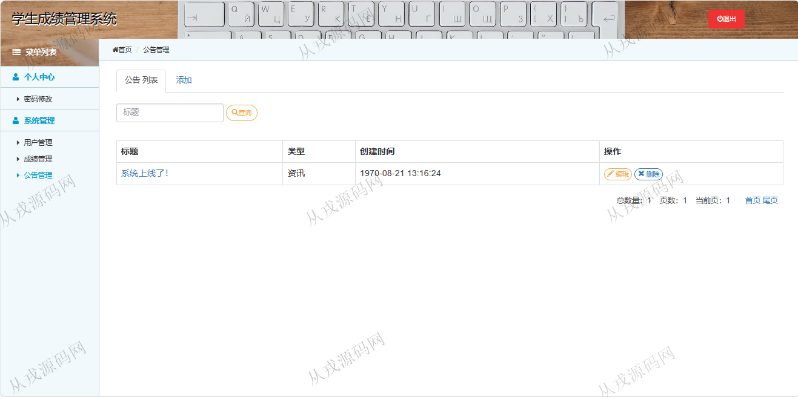

<h1 align="center">206.学生成绩管理系统</h1>

 获取sql文件 QQ: 386869957 QQ群: 377586148 

 [更多源码项目: 从戎源码网](https://armycodes.com/) 

## 简介

> 本代码来源于网络,仅供学习参考使用!
>
> 提供1.远程部署/2.修改代码/3.设计文档指导/4.框架代码讲解等服务
>
> http://localhost:8080/score/
> 
> 管理员：admin 123456
> 
> 学生：student 123456
>

## 项目介绍
基于ssm的学生成绩管理系统：前端 jsp、jquery、bootstrap，后端 maven、springmvc、spring、mybatis；角色分为管理员、学生；集成用户管理，成绩管理，公告管理等功能于一体的系统。

## 功能介绍

- 基本功能：登录，注册，退出，密码修改
- 用户管理：用户信息的增删改查，用户也可以由学生自行注册，管理员可以修改和删除用户信息，学生只能操作自己的信息
- 成绩管理：管理员对成绩信息的增删改查，学生只能查询
- 公告管理：管理员对公告信息的增删改查，学生只能查看

## 环境

- <b>IntelliJ IDEA 2021.3</b>

- <b>Mysql 5.7.26</b>

- <b>Tomcat 7.0.73</b>

- <b>JDK 1.8</b>

## 运行截图

